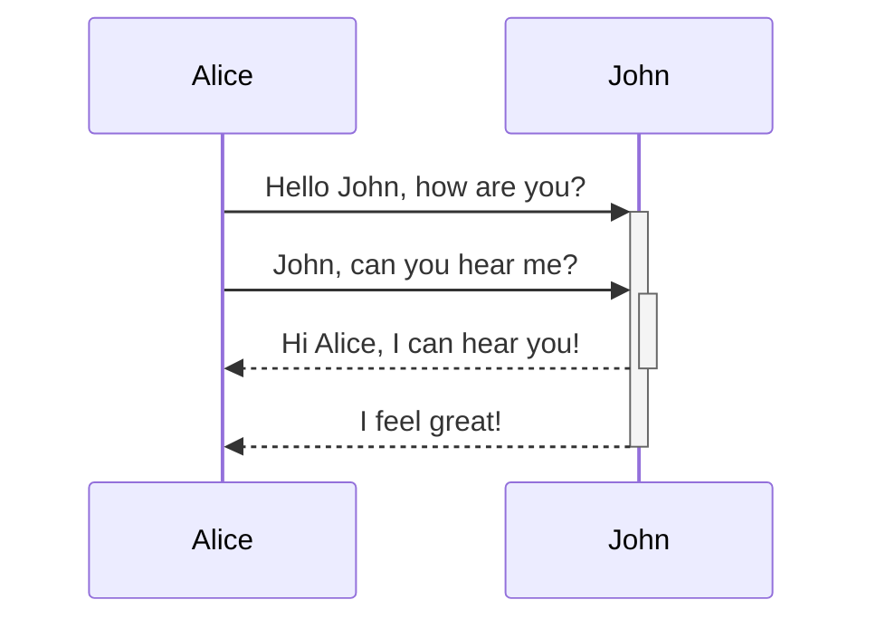

---
aliases:
  - й
cssclasses:
  - ва
tags:
  - java
---
# ЗАГОЛОВОК ![[Pasted image 20240828141120.png | 32]]

 ## FDDF 
dfdf
dfdf

#### fdfdfddg

> fdfdf
> fdf

fdfd#аываываы3№####


---
title: A New Hope
year: 1977

		---

![[Pasted image 20240828141120.png | 32]]


**dfdf**
dfdf
<svg xmlns="http://www.w3.org/2000/svg" width="24" height="24" viewBox="0 0 24 24" fill="none" stroke="currentColor" stroke-width="2" stroke-linecap="round" stroke-linejoin="round" class="lucide lucide-utensils"><path d="M3 2v7c0 1.1.9 2 2 2h4a2 2 0 0 0 2-2V2"/><path d="M7 2v20"/><path d="M21 15V2a5 5 0 0 0-5 5v6c0 1.1.9 2 2 2h3Zm0 0v7"/></svg>

**fdfdfdfdf ** fdf  dfdfds аплдапдл ылвдал дыважыдв маин_
*fdffdf*
`fdfdfdfff`
==dfdf==
%% fdffdfdf %%

dfdsf
sdf
sf
Шрифт достаточно приятный 
Э

^gg

> вавав
> вава
> 

> [!tip] Callouts can have custom titles > Like this one.
> dfdfd
> dfdf

> [!faq]- Are callouts foldable? 
> > 
> Yes! In a foldable callout, the contents are idden when the callout is collapsed.
> fdf
> df

> [!faq] Can callouts be nested? 
> >[!todo] Yes!, they can. 
> > > [!example] You can even use multiple layers of nesting.


> [!faq]- Are callouts foldable?
> W
> >[!todo] Yes!, they can. 

[Гайд по Obsidian](https://www.youtube.com/watch?v=unvwJRgX2bs)

==пассатижи==

> АБЗАЦ

> Цитата
> !!!!


[[Что нужно для описания OBSIDIANE]]

$$ \begin{vmatrix}a & b\\ c & d \end{vmatrix}=ad-bc $$

-----
******


* * * *




>[!info] ВААУ!!
>авава


А вот это `code` ))))
-
- fdfd
- fdf 
	- dfdd 
	- fdfd
# FFF


```Java
@Service
@RequiredArgsConstructor
@Transactional(readOnly = true)
public class UserService implements UserDetailsService {

    private final UserRepository userRepository;
    private final UserReadMapper userReadMapper;
    private final UserCreateMapper userCreateMapper;
    private final ChatReadMapper chatReadMapper;

    public List<ChatReadDto> findAllByUserChats(Long id) {
        return userRepository.findAllByUserChats(id).stream()
                .map(chatReadMapper::map)
                .collect(toList());
    }

    @PreAuthorize("hasAuthority('ADMIN')")
    public List<UserReadDto> findAll() {
        return userRepository.findAll().stream()
                .map(userReadMapper::map)
                .collect(toList());
    }


```
![[Pasted image 20240828124652.png]]
![[Pasted image 20240828124740.png]]![[Pasted image 20240828125030.png | 945]]


<iframe src="https://annimon.com/article/2778"></iframe>


![[Pasted image 20240828134313.png |]]

ва


авав

 ва#апвпв 
 ##ваы##
dfsdf